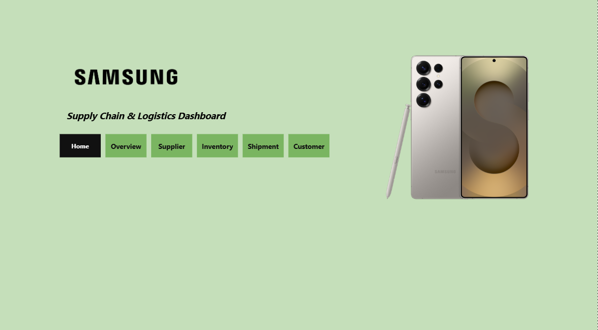

# 📦 Samsung Supply Chain Analytics Dashboard

## 📌 Project Overview
This project presents an end-to-end **Supply Chain Analytics Dashboard** built to monitor and optimize key operations such as procurement, inventory, shipment, and delivery performance.

The dashboard provides actionable insights to improve efficiency, reduce delays, and support data-driven decision-making across the supply chain.

---

## 🖼️ Dashboard Preview

---

## 🚀 Key Features
- 📊 Interactive multi-page dashboard (10+ report pages)  
- 🔖 Bookmark-based navigation for seamless user experience  
- 🧭 Custom page navigation using buttons  
- 🔐 Row-Level Security (RLS) for role-based data access  
- 📈 KPI tracking for supply chain performance  
- 📦 End-to-end visibility from procurement to delivery  

---

## 📊 Key Insights
- Supplier performance analysis  
- Inventory stock levels and trends  
- Shipment and delivery tracking  
- Order delays and fulfillment efficiency  
- Customer demand patterns  

---

## 🛠️ Tools & Technologies
- Power BI  
- Excel  
- Data Modeling (Star Schema)  
- DAX (Data Analysis Expressions)  

---

## 🧠 Data Model
- Designed a **Star Schema** for efficient querying and reporting  
- Fact table: Orders / Transactions  
- Dimension tables: Supplier, Customer, Product, Time, Location  

---

## 🔐 Security Implementation
- Implemented **Row-Level Security (RLS)** to simulate role-based access  
- Ensures users can only view data relevant to their role  

---

## 📈 Visualizations Included
- KPI Cards (Orders, Delays, Revenue, Inventory)  
- Bar Charts & Column Charts  
- Line Charts (Trend Analysis)  
- Pie/Donut Charts  
- Drill-down Reports  
- Interactive Filters & Slicers  

---

## ⚙️ How to Use
1. Open the `.pbix` file in Power BI Desktop  
2. Explore different report pages using navigation buttons  
3. Use filters and slicers to analyze specific data  
4. تجربه RLS by switching user roles (if configured)  

---

## ⚠️ Challenges
- Handling complex supply chain data relationships  
- Designing efficient data models (Star Schema)  
- Implementing RLS for realistic business scenarios  
- Creating intuitive navigation across multiple pages  

---

## 🔮 Future Enhancements
- Integrate real-time data sources  
- Add predictive analytics (demand forecasting)  
- Deploy dashboard to Power BI Service  
- Automate data refresh pipelines  

---

## 👩‍💻 Author
**Suganthi Ganesan**  
- MSc Graduate  
- AI/ML & Data Science Enthusiast  

---

## ⭐ Support
If you found this project useful, give it a ⭐ on GitHub!
